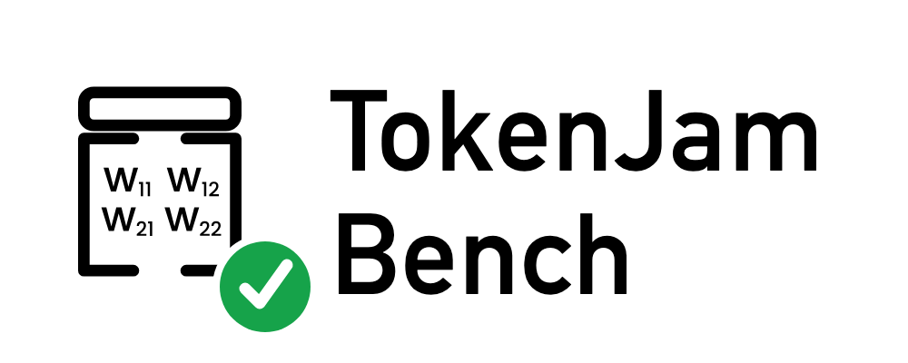

<div align="center">

<picture>
  
</picture>

## Evidence-based Benchmarking & Evaluations for Agents & LLMs

Does TokenJam's "downsize this model" recommendation hold up? TokenJam Bench runs the cheaper model against executable benchmarks and tells you (with statistics) where it keeps up and where it breaks and validates if the savings are true.

[](https://github.com/Metabuilder-Labs/tokenjam-bench/actions/workflows/ci.yml)
[](tests/)
[](pyproject.toml)
[](https://pypi.org/project/tokenjam/)
[](LICENSE)

```bash
pipx install tokenjam-bench
```

<sub>Don't have pipx? `brew install pipx` on macOS, `apt install pipx` on Debian/Ubuntu. `pip install tokenjam-bench` also works in a clean venv.</sub>

**No cloud · No signup · Runs Locally**

</div>

---

It answers the one question TokenJam itself can't: *when TokenJam says "downsize this model," does the cheaper model still get the work right — and how much does it actually save?*

```
benchmark tasks ─▶ run on ORIGINAL model ─▶ score (pass/fail) + cost
                ─▶ run on CANDIDATE model ─▶ score (pass/fail) + cost
                ─▶ proof: Δaccuracy (objective) + Δcost, stamped to tokenjam vX.Y.Z
```

---

## How it's a proof of *TokenJam* (not a generic model comparison)

- The cheaper **candidate** is the model TokenJam's own downsize analyzer would route to — pulled live from `tokenjam.core.optimize.DOWNGRADE_CANDIDATES`.
- **Cost** is priced with TokenJam's own pricing table (`tokenjam.core.pricing.get_rates`) — same dollars TokenJam reports.
- **Accuracy** is the benchmark pass-rate against real test suites — a *measurement*, never a judgment.
- Every result is **stamped with the exact TokenJam version** under test.

---

## Real evidence: downsizing Claude to Haiku breaks code, not math

The 2026-06-26 multipair run benchmarked 18 model-pair × suite configurations at real measured rates (tokenjam 0.5.2). The sharpest result comes from routing `claude-opus-4-7` down to `claude-haiku-4-5`. The cheaper model costs far less. It holds on grade-school math and falls apart on code.

| suite | pass rate (opus → haiku) | Δ accuracy [95% CI] | measured cost Δ | McNemar | verdict |
|---|---|---|---|---|---|
| HumanEval (code) | 90% → 56% | −34pp [−47.1, −20.9] | −81.6% | p&lt;0.001 | **`significant_regression`** |
| GSM8K (math) | 98% → 96% | −2pp [−5.9, +1.9] | −59.2% | p=1.000 | `no_significant_regression` |

Same downsize, opposite calls. On code the bench flags a regression you would not want to ship. On math the cheaper model is statistically indistinguishable from the original while costing about 60% less. Reporting a single blended "accuracy" would have hidden both facts, so the bench reports per benchmark and lets the McNemar test decide each one.

The same code regression shows up for `claude-sonnet-4-6 → claude-haiku-4-5` (94% → 56%, `significant_regression`). The `gpt-4o → gpt-4o-mini` and `o3 → o4-mini` downsizes pass HumanEval at this sample size.

Full run (18 configs, 7 suites, real rates): [`docs/evidence/live/2026-06-26-multipair/`](docs/evidence/live/2026-06-26-multipair/). Browse it with `tjb serve`.

---

## Five Proof Modes

<table>
<tr>
<td width="50%" valign="top">

### 🧪 Single-shot benchmark

Run tasks on both models, score against objective ground truth, attach Wilson CIs + McNemar p-value.

```bash
tjb run --benchmark humaneval \
  --original anthropic:claude-opus-4-7 \
  --limit 50
```

[Details →](docs/pipelines.md)

</td>
<td width="50%" valign="top">

### 🤖 Agent benchmark

Multi-turn tool-calling proof with a safety gate — the same Wilson/McNemar rigor applied to agentic workloads.

```bash
tjb agent --benchmark sample-agent \
  --original anthropic:claude-opus-4-7 \
  --mock
```

[Details →](docs/agents.md)

</td>
</tr>
<tr>
<td width="50%" valign="top">

### 🔁 Replay validation

Replay your real TokenJam telemetry against the cheaper candidate. No synthetic tasks — your actual prompts, scored for **agreement with your historical outputs** (not correctness, not safety: the original model's output is the reference).

```bash
tjb replay \
  --telemetry ~/.config/tj/tj.duckdb \
  --judge deepseek --limit 50
```

[Details →](docs/replay.md)

</td>
<td width="50%" valign="top">

### 📊 Cross-version matrix

Diff proof artifacts across TokenJam releases. Flags accuracy regressions, savings shrinkage, and recommendation changes automatically.

```bash
tjb matrix --dir results/
```

[Details →](docs/cli-reference.md)

</td>
</tr>
<tr>
<td width="50%" valign="top">

### 🖥 Live dashboard

Self-contained proof browser — auto-refreshes as new artifacts land in `results/`. No cloud, no signup.

```bash
tjb serve --open
```

[Details →](docs/cli-reference.md)

</td>
<td width="50%" valign="top">

### 🔍 HTML reports

Every proof writes a version-stamped JSON artifact and renders a self-contained HTML report alongside it.

```bash
tjb run ... --html
tjb report results/tjbench_*.json
```

[Details →](docs/cli-reference.md)

</td>
</tr>
</table>

---

## Quickstart (offline, no keys)

```bash
pip install -e .
tjb run            # runs the `samples` benchmark, anthropic:claude-opus-4-7 → its TokenJam candidate
tjb serve          # browse the bundled real evidence in the dashboard
```

`tjb run` with no flags is offline-first: with no provider key in the environment it auto-enables mock mode (no SDKs, no keys, no spend — numbers illustrative, plumbing real) and writes a version-stamped artifact. Set a provider key (e.g. `ANTHROPIC_API_KEY`) and it runs for real.

## Real proof (live, multi-provider)

```bash
pip install -e ".[providers,datasets]"
export ANTHROPIC_API_KEY=...      # and/or OPENAI_API_KEY / DEEPSEEK_API_KEY
tjb run --benchmark humaneval \
  --original anthropic:claude-opus-4-7 \
  --limit 50 --html
```

## Replay your own sessions (DeepSeek)

```bash
pip install -e ".[providers,judge]"
export DEEPSEEK_API_KEY=...
TJBENCH_JUDGE=deepseek tjb replay \
  --telemetry sessions.jsonl \
  --candidate deepseek:deepseek-chat \
  --judge deepseek --limit 50 --html
```

---

## Benchmarks

| name | ground truth | needs | notes |
|---|---|---|---|
| `samples` | built-in code + math tasks | nothing (offline) | smoke test, always runs |
| `humaneval` | unit-test pass/fail | `[datasets]` | executable — runs model code in subprocess |
| `gsm8k` | numeric exact-match | `[datasets]` | |
| `judged` | DeepEval correctness | `[judge,providers]` | LLM-as-judge; key-gated |
| `sample-agent` | tool use + safety gate | nothing (offline) | agent benchmark |
| `swe-bench-lite` | ⚠️ none — experimental scaffold | SWE-bench dataset | tool/prompt scaffold only; **fix-verification not implemented**, scoring disabled — not a real pass-rate |
| `replay` | agreement with the original model's own historical output | `[providers]` + telemetry | your real sessions; measures agreement-with-history, not correctness/safety |

---

## Statistics

Every proof carries its full statistical block — no single fabricated confidence scalar:

- **Wilson score interval** — `46/50` becomes `92% [95% CI 81–97%]`, not just `92%`
- **McNemar's exact paired test** — correct for same-task paired comparison (not a two-proportion z-test)
- **Paired delta CI** — 95% CI on the accuracy delta itself, consistent with McNemar
- **pass@k** — unbiased Chen et al. 2021 estimator for multi-sample runs
- **Verdicts**: `no_significant_regression` · `significant_regression` · `insufficient_evidence` — never `SAFE`

Zero external dependencies (`scipy`, `numpy` not required). Pure Python from first principles. [Full writeup →](docs/statistics.md)

---

## TokenJam changes every day — that's the design center

TokenJam is consumed as a **published package**, never vendored:

```bash
make update-tokenjam     # pip install -U tokenjam; prints the new version
tjb version          # shows the exact tokenjam build proofs will stamp
tjb run ...          # every artifact records tokenjam_version
tjb matrix           # diff proofs across releases; exits non-zero on regression
```

Because every artifact in `results/` carries `tokenjam_version`, you can re-run the same benchmark across releases and catch the day a TokenJam change moves the numbers. `tjb matrix` doubles as a CI guard.

---

## Testing

```bash
pip install -e ".[dev]"
pytest
```

| Module | Tests | What's covered |
|---|---|---|
| `test_stats.py` | 9 | Wilson CI, McNemar exact, paired delta CI, pass@k edge cases |
| `test_pipeline_offline.py` | 8 | Full proof pipeline, mock + real candidate, savings direction |
| `test_matrix.py` | 8 | Cross-version regression detection, sorting, serialisation |
| `test_replay.py` | 7 | JSONL + DuckDB loader, dominant_model, replay pipeline wiring |
| `test_judge.py` | 6 | MockJudge overlap, DeepEval backend resolution, metric routing |
| `test_deepseek.py` | 6 | OpenAI-compatible client, mock-directive stripping, provider registry |
| `test_real_scenarios.py` | 6 | Real-scenarios benchmark scoring + agent trace validation |
| `test_agent_validation.py` | 4 | Safety gate, tool ordering, forbidden-tool blocking |
| `test_scoring.py` | 4 | Code extraction, exact-match normalisation, number parsing |
| `test_report_html.py` | 4 | HTML render, artifact load, regression flag rendering |
| `test_agent_pipeline_offline.py` | 3 | Agent proof pipeline, token aggregation, assemble_proof parity |
| `test_agent_runner.py` | 3 | Multi-turn loop, max-turns guard, tool execution |
| `test_dashboard.py` | 3 | Dashboard artifact loading, serve routing |
| `test_report.py` | 3 | ProofResult derived properties, headline, write/round-trip |
| `test_swe_bench_lite.py` | 19 | swe-bench scaffold: scoring-disabled gate + tools/parsing |
| `test_version_stamp.py` | 1 | resolve_tokenjam_build metadata read |

All tests run offline with no provider SDKs or keys. Live-provider tests skip cleanly without `[providers]` installed.

---

## Honesty

Accuracy = pass-rate on the chosen benchmark suite — never a general "quality preserved" claim. Reports record `n`, flag `--mock` runs as illustrative, and flag when cost fell back to TokenJam's `$0.50/$2.00` default placeholder rates. There is deliberately **no single `confidence = 95%` scalar** — the honest expression is the CI + p-value. Executing model-generated code (HumanEval) happens in a timed subprocess; run only trusted benchmark suites on a machine you control.

> **Boundary statement.** tokenjam-bench is an *offline measurement layer*. It tells you whether a downsize candidate held up **on these benchmark suites**, and — for `replay` — whether it **agreed with your own historical outputs** (the original model's past output is the reference, so replay measures agreement-with-history, not correctness and not safety). It is **not** a runtime safety certification: it does not monitor production traffic, gate live requests, or guarantee the candidate will behave on inputs outside what was measured here.

---

## FAQ

**Does a passing verdict mean the cheaper model is safe to deploy?**
No. A verdict is the pass-rate on a specific suite plus a McNemar test. `no_significant_regression` means the bench did not detect a drop on that suite at this sample size. It is not a runtime safety certification, and it says nothing about inputs outside the measured set.

**Why did the same downsize pass on math and fail on code?**
Accuracy is per-suite. `claude-haiku-4-5` matched the original on GSM8K and dropped 34 points on HumanEval. A single blended number would bury that, so the bench scores each benchmark on its own.

**Do I need API keys?**
No. `tjb run` is offline-first: with no provider key set it auto-enables mock mode and still writes a stamped artifact. Add a key like `ANTHROPIC_API_KEY` to run for real.

**What are the verdicts, and why no confidence score?**
The three are `no_significant_regression`, `significant_regression`, and `insufficient_evidence`. There is no single confidence percentage on purpose. The honest expression of certainty is the Wilson CI plus the McNemar p-value.

**Why are some old runs priced with default rates?**
A provider without a TokenJam rate falls back to a $0.50/$2.00 placeholder. Those runs are flagged and kept under `docs/evidence/archive/`, out of the dashboard's headline path. The 2026-06-26 multipair run uses real rates.

**How is this a proof of TokenJam and not a generic comparison?**
The candidate model and the cost rates both come from the installed `tokenjam` package, and every artifact is stamped with the exact version that produced it.

---

## Project Layout

```
cli.py                CLI entry point (tjb version | recommend | run | agent | replay | matrix | serve | report)
pipeline.py           Single-shot proof pipeline (run_proof, assemble_proof)
agent_pipeline.py     Agent proof pipeline (run_agent_proof)
replay.py             Telemetry loader (.jsonl / .duckdb read-only)
replay_pipeline.py    Replay measurement — real sessions, judge-scored agreement with the original model's historical output
report.py             ProofResult, ProofStats, TaskOutcome dataclasses
stats.py              Wilson, McNemar exact, paired delta CI, pass@k (zero deps)
cost.py               Pricing via tokenjam.core.pricing.get_rates
recommend.py          Candidate resolution via tokenjam.core.optimize.DOWNGRADE_CANDIDATES
version.py            Installed tokenjam version stamp
exec_sandbox.py       Subprocess sandbox for model-generated code (HumanEval)
judge.py              MockJudge (offline) + DeepEvalJudge (key-gated)
deepeval_judge.py     DeepEval adapter (correctness / relevancy / faithfulness / task-completion)
matrix.py             Cross-version regression detection
dashboard.py          Local proof browser (auto-refresh)
report_html.py        Self-contained HTML report renderer

models/               Provider-agnostic model clients
  base.py             Completion dataclass, ModelClient protocol
  registry.py         parse_spec, get_client (live + mock)
  openai_compatible.py  OpenAI + DeepSeek (+ future) via one abstraction
  anthropic_client.py   Live Anthropic single-shot
  google_client.py      Live Google Gemini
  mock_client.py        Offline deterministic
  anthropic_agent_client.py  Live Anthropic tool-calling
  mock_agent_client.py       Offline deterministic tool-calling
  tool_calling.py       ToolCall, AssistantTurn, ToolCallingClient protocol

benchmarks/           Benchmark definitions + scoring
  base.py             Task, ScoreResult, Benchmark protocol
  scoring.py          score_code (subprocess), score_exact_match
  samples.py          Built-in offline benchmark (code + math)
  humaneval.py        HumanEval loader
  gsm8k.py            GSM8K loader
  judged.py           LLM-judged benchmark (DeepEval)
  real_scenarios.py   Real-world scenario tasks
  agent_base.py       AgentTask, AgentBenchmark protocol
  sample_agent.py     Offline agent benchmark (tool use + safety)
  swe_bench_lite.py   experimental scaffold — tool-usage only (no fix verification)

agents/               Multi-turn agent execution
  runner.py           AgentRunner — the multi-turn loop
  tools.py            Tool, ToolResult, ToolRegistry
  trace.py            AgentTrace, TurnRecord, ToolCallRecord
  validation.py       validate_tools — safety gate

results/              Version-stamped JSON + HTML proof artifacts
docs/                 Full documentation
docs/brand/           Logo lockup + jar icon (SVG + PNG)
docs/evidence/        Real proof runs; headline set in live/2026-06-26-multipair/
docs/evidence/archive/  Pre-multipair runs, kept for provenance (non-headline)
tests/                Offline pytest suite (no keys, no network)
```

---

## Documentation

| Doc | Contents |
|---|---|
| [docs/README.md](docs/README.md) | Documentation index |
| [docs/overview.md](docs/overview.md) | What this project is and why it exists |
| [docs/architecture.md](docs/architecture.md) | System design, data flow, module relationships |
| [docs/quickstart.md](docs/quickstart.md) | Get running in 5 minutes |
| [docs/cli-reference.md](docs/cli-reference.md) | Complete `tjb` command reference |
| [docs/pipelines.md](docs/pipelines.md) | Single-shot and agent proof pipelines |
| [docs/replay.md](docs/replay.md) | Replay validation — your real sessions |
| [docs/models.md](docs/models.md) | Model client adapters and protocols |
| [docs/benchmarks.md](docs/benchmarks.md) | Available benchmarks and scoring |
| [docs/agents.md](docs/agents.md) | Multi-turn agent execution framework |
| [docs/statistics.md](docs/statistics.md) | Statistical methods used for proof |
| [docs/cost-pricing.md](docs/cost-pricing.md) | How costs are computed |
| [docs/tokenjam-integration.md](docs/tokenjam-integration.md) | How we consume TokenJam |
| [docs/development.md](docs/development.md) | Contributing, testing, extending |
| [docs/api-reference.md](docs/api-reference.md) | Module-level API documentation |
| [docs/proof-runbook.md](docs/proof-runbook.md) | Reproduce the first evidence runs |

---

## Related Projects

- **[TokenJam](https://github.com/Metabuilder-Labs/tokenjam)** — The main cost-optimization and observability platform
- **[TokenJam Docs](https://github.com/Metabuilder-Labs/tokenjam/tree/main/docs)** — TokenJam's own documentation
- **[TokenJam Python SDK](https://github.com/Metabuilder-Labs/tokenjam/tree/main/tokenjam/sdk)** — SDK for instrumenting agents
